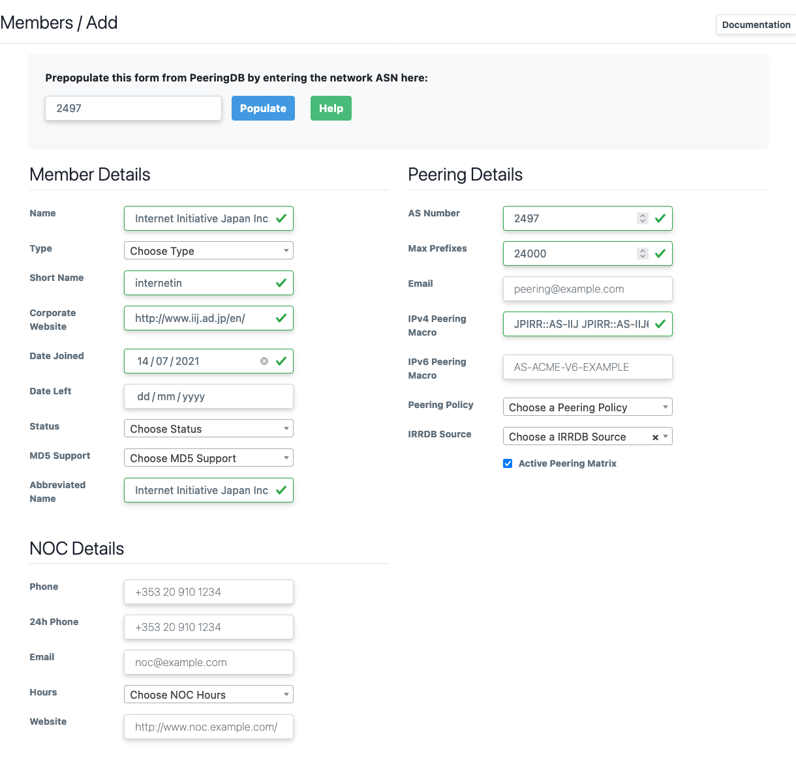
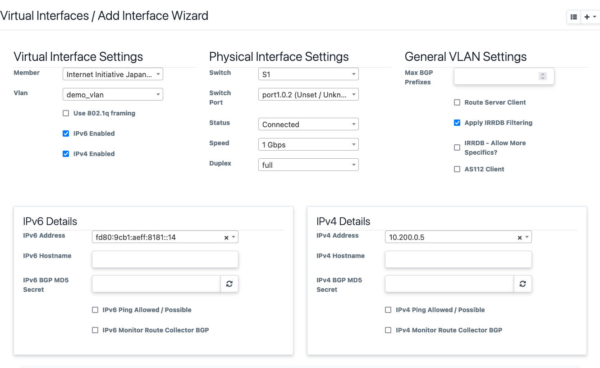

First Time IXP Manager Setup
============================

Congratulations, you have installed HolistIX and its components. This section
will go over setting up some basic information inside IXP Manager and HolistIX
as a tutorial.

This is not a conclusive guide to IXP Manager, and we will use a lot
of examples. However, the goal is to summarize the basic information that HolistIX
expects and requires to be set up. For a more in-depth guide, we recommend
checking out the `IXP Manager documentation <https://docs.ixpmanager.org/>`_
or their `video tutorial series <https://www.ixpmanager.org/support/tutorials>`_.

IXP Manager
-----------

This will go over some of the basic elements needed in IXP Manager to describe
your IXP. We can find most of these found under **IXP ADMIN ACTIONS** on the
left sidebar. When creating a new instance of these, click the |add| button on
the top right of the page to create a new instance.

.. |add| image:: add.png
    :width: 20

The bare minimum needed to be setup within IXP Manager is the following in order:

- Infrastructure
- Facilities
- Racks
- Switches
- Designate core ports
- VLAN(s)
- Peering IPs
- Member/Customer
- Member Connection

Infrastructure
~~~~~~~~~~~~~~

An infrastructure generally consists of a collection of switches that form an
IXP Peering LAN. Think of these as an IXP. Where each infrastructure consists of
a unique set of switches and these infrastructures are not interconnected. They
also typically have their own unique PeeringDB and IX-F entry.

.. note::

    HolistIX currently only supports generating configuration for a single
    infrastructure at this time.

Facilities
~~~~~~~~~~

Your point of presences - the data centres where networks can connect to one of
IX switches.

Racks
~~~~~

The racks where your switches and patch panels are located.

Switches
~~~~~~~~

You can now add your switches and assign them to a rack and infrastructure. We
recommend making use of the SNMP (v2) service that IXP Manager has. It is
important to note that IXP Manager will need SNMP access to your switches for
this. We also recommend that your switches have a domain name registered
in DNS, and to avoid using IP addresses here.

We recommend looking at IXP Manager's
`documentation for switches <https://docs.ixpmanager.org/usage/switches/>`_.

.. _dpid:

Switch IDs:
^^^^^^^^^^^

Once the switch, is added you can view the switch id when you look at the details
of the switch. The ID will be shown as ``(DB ID: X)``. This will be the ID that
you need to assign on the OpenFlow Switch.

.. todo::

    Add the details for running virtual switches

    For testing HolistIX without physical switches, see here.

Designate Core Ports
~~~~~~~~~~~~~~~~~~~~

Currently, there are no ways to declare core links within IXP Manager. However,
we can declare which ports on our switches will use for core connectivity.

For this we need to open ``Switches`` on the left sidebar, which will
expand the switches submenu, and then open ``Switch Ports``.

On the top right, next to the |add| button, click on the arrow and filter to the
switch that's ports you want to change. For changing multiple ports, click on
the ``View / Edit Ports`` underneath the ``SNMP Actions`` section, for individual
ports you can click ``View / Edit ports`` under the ``Database Actions``.

Find the ports that you want to designate as core ports and change the
``port type`` to ``Core``.

.. note::

    If no core ports are designated for a switch, you will not be able to
    connect it to another switch within Miru

VLANs
~~~~~~~

You will need at least 1 VLAN configured. IXP Manager recommends a separate
quarantine VLAN.

With HolistIX, we only allow traffic from per approved members and their specific
configured connections. We encode the paths to each configured member on the
switches and translate broadcast traffic to unicast, and any other unknown or
bad traffic is dropped at the edge.

.. todo::

    Add link to detail explanation. Also add the detailed explanation.

Peering IPs
~~~~~~~~~~~~~

Add your peering addresses. This can be either individual addresses or complete
ranges (e.g. /24) and a more sensible range for v6 (i.e. not an entire /64)

Member/Customers
~~~~~~~~~~~~~~~~

One of the features that IXP Manager provides is to auto fill member details via
PeeringDB. Reducing admin and accounting errors.

Once the member details have been added, IXP Manager will also request that you
enter their registration and billing details. Although not required for testing
with HolistIX, this is strongly recommended to help with administration tasks.

Member Connection
~~~~~~~~~~~~~~~~~

To add a connection to a member, you need to open up ``Interfaces/Ports`` on the
left sidebar and click the |add| button, and then ``Add Interface Wizard``.

This opens the add interface wizard. From here you can select a member, what
peering VLAN they will use, the switch and port they connect to, etc. The IP
addresses are pulled from the previously configured IP address range, and limits
choices to unused IPs.

Once done, it will take you to the Edit interface page. Here you can add more
VLAN interfaces to your physical interface. If the member's connection is VLAN
tagged, tick the 802.1Q box. Configure the MAC addresses for each connection.

While IXP Manager supports multiple MAC addresses per IP address, HolistIX only
supports a single MAC address per IP.

.. important::

    You need to configure the MAC address of the members' connection here. We
    use this when translating broadcast traffic into unicast.

    If not configured correctly, traffic **WILL NOT** reach a member.

Add your members as they will be/are connected to your IXP. It is important that
this reflects what is running in production, we only send traffic to a member on
the port with the given IPv4/6 and MAC address that is configured.
